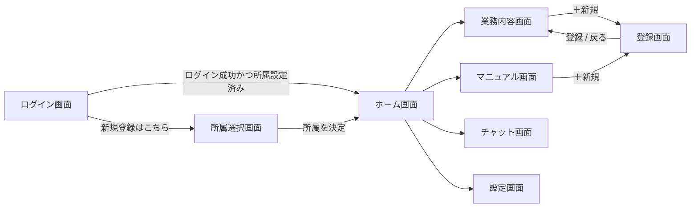
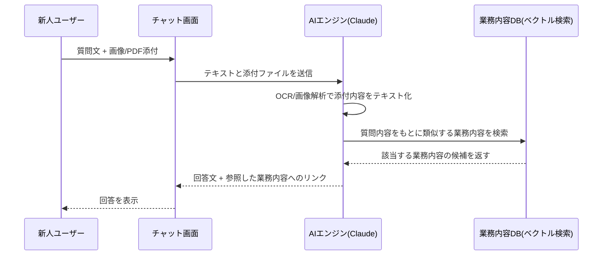
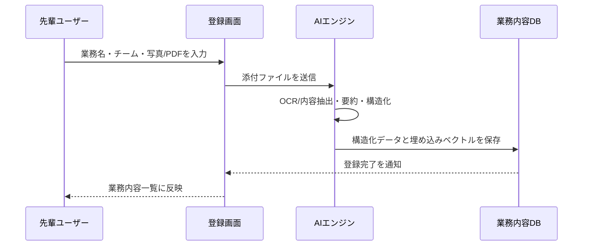
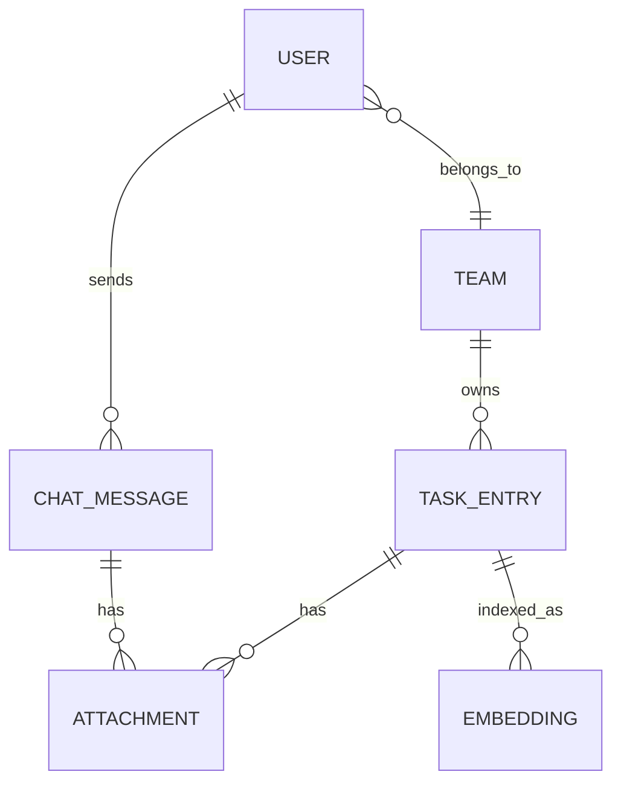

# 新-cha- 仕様書

チャット・写真・PDFを送るだけで、新人が業務内容を理解できるようになる社内ナレッジアプリ。AIが送られてきた内容を読み取り、蓄積された業務情報から適切な回答を返す。PCのWebブラウザからアクセスする業務システムとして設計する。

- **version**: 0.1 (draft)
- **作成日**: 2026-08-29
- **元資料**: 手書きワイヤーフレーム 6点（IMG_6154〜IMG_6159）
- **対象環境**: PC / Web ブラウザ

## 目次

1. [概要](#1-概要)
2. [画面構成・遷移](#2-画面構成遷移)
3. [ログイン画面](#3-ログイン画面)
4. [所属選択画面](#4-所属選択画面)
5. [ホーム画面](#5-ホーム画面)
6. [業務内容画面](#6-業務内容画面)
7. [登録画面（業務内容の新規登録）](#7-登録画面業務内容の新規登録)
8. [チャット画面](#8-チャット画面)
9. [マニュアル画面／設定画面](#9-マニュアル画面設定画面)
10. [AI連携仕様](#10-ai連携仕様)
11. [データ設計（概要）](#11-データ設計概要)
12. [非機能要件](#12-非機能要件)
13. [未確定事項](#13-未確定事項)

---

## 1. 概要

### 1.1 目的

新人が「これはどう対応すればいいんだっけ」と迷ったときに、チャット・写真・PDFのいずれかで質問すれば、AIが社内に蓄積された業務内容から適切な情報を選び出して答える。合わせて、先輩社員が業務内容を写真やPDFのまま登録するだけで、その情報がデータベースに蓄積され、次の新人の助けになる循環をつくる。

### 1.2 対象ユーザー

| 区分 | 想定する使い方 |
|---|---|
| 新人 | 業務内容画面・マニュアル画面で学び、わからないことはチャットで質問する。写真・PDFを撮って送るだけでよい。 |
| 先輩・管理者 | 登録画面から業務手順の写真・PDFをアップロードし、ナレッジベースを育てる。所属チームの業務内容を整理する。 |

### 1.3 提供環境

スマホアプリではなく、PCのWebブラウザからアクセスする形式とする。手書き案の画面比率も横長のブラウザウィンドウを想定しており、業務中にPCで開いて使うことを前提にレイアウトする。

---

## 2. 画面構成・遷移

全8画面：ログイン／所属選択／ホーム／業務内容／登録／チャット／マニュアル／設定。ホームを中心に、業務内容・マニュアル・チャット・設定の4機能へ放射状にアクセスする構成。



実線は手書き資料に描かれた導線、表示タイミング（初回のみ／随時）は各章で個別に注記する。

---

## 3. ログイン画面

左に湯呑みマスコット、右にID・パスワードの入力フォームを置く2カラム構成。（元画像 IMG_6155）

```
┌────────────────────────────────────────────┐
├────────────────┬─────────────────────────────┤
│                │ ログイン                     │
│    🍵           │ ID       [_______________]  │
│  しんちゃ        │ パスワード [_______________] │
│ (アイコンを      │ パスワードを忘れた方はこちら  │
│  大きく主張)     │ [   新規登録はこちら   ]      │
│                │ [      ログイン        ]      │
└────────────────┴─────────────────────────────┘
```

> 手書きメモ：「アイコン ここぞとばかりに主張」／ID／パスワード／forget／しんきとうろく／ログイン

| 要素 | 種別 | 挙動 |
|---|---|---|
| マスコット（左ペイン） | ブランド表示 | ログイン画面はマスコットを最も大きく主張して表示し、アプリの第一印象をつくる。他画面ではロゴサイズに縮小する。 |
| ID | テキスト入力 | 社員IDまたはメールアドレスを入力。 |
| パスワード | パスワード入力 | マスク表示。 |
| パスワードを忘れた方はこちら | リンク | 再設定用メール送信フローへ遷移。 |
| 新規登録はこちら | ボタン（副） | アカウント作成フローへ。作成後、所属選択画面に進む。 |
| ログイン | ボタン（主） | 認証成功でホーム画面へ。所属未設定のアカウントは所属選択画面へ誘導する。 |

---

## 4. 所属選択画面

新規登録直後に、自分のチーム・部署を選ぶ画面。（元画像 IMG_6156）

```
┌────────────────────────────────────────────┐
├────────────────┬─────────────────────────────┤
│                │ 所属を選択してください。      │
│    🍵           │ ┌───────────────────────┐   │
│  しんちゃ        │ │ 選択してください ▼     │   │
│                │ ├───────────────────────┤   │
│                │ │ 営業チーム             │   │
│                │ │ 開発チーム             │   │
│                │ │ カスタマーサポート      │   │
│                │ └───────────────────────┘   │
└────────────────┴─────────────────────────────┘
```

> 手書きメモ：「所属部署選択画面」／「プルダウンでだーって出てくる」／「頭文字検索できたらhappy」／「チームごとに分類されている」

| 要素 | 種別 | 挙動 |
|---|---|---|
| 所属を選択してください。 | 案内文 | 初回登録時のみ表示（所属未設定のユーザーがログインした場合も表示）。 |
| 所属プルダウン | ドロップダウン選択 | クリックで全チームがリスト展開される。チームごとに分類して表示し、頭文字入力での絞り込み検索に対応する（インクリメンタルサーチ）。 |
| 決定 | ボタン | 選択したチームをアカウントに保存し、ホーム画面へ遷移する。 |

> **補足**：手書きメモの「頭文字検索できたらhappy」は優先度の低い付加機能として扱い、初期リリースの必須要件からは外して良い。

---

## 5. ホーム画面

ログイン後の起点画面。左にマスコットとアプリ名、右に4つの機能への入口を2×2で配置する。（元画像 IMG_6154）

```
┌────────────────────────────────────────────┐
├────────────────┬──────────────┬──────────────┤
│                │  📖 業務内容  │  💬 チャット  │
│  🍵 新-cha-     │              │              │
│    New-Tea-     ├──────────────┼──────────────┤
│                │  🧑 マニュアル │  ⚙ 設定      │
│                │              │              │
├────────────────┴──────────────┴──────────────┤
│      呼び方ボタン（キャラの呼び方を設定）        │
└────────────────────────────────────────────┘
```

> 手書きメモ：「アイコン」／「キャラ」／「新しい業務を伝えるボタン」／「チャットボタン」／「せってぃボタン」／「呼い方ボタン」

| 要素 | 種別 | 挙動 |
|---|---|---|
| アプリロゴ／マスコット | ブランド表示 | 左ペインに常設。アプリ名「新-cha- / New-Tea-」と湯呑みキャラクターを表示。 |
| 業務内容 | ナビゲーションカード | 業務内容画面へ。手書きメモの「新しい業務を伝えるボタン」が指す先であり、＋新規から新しい業務の登録にも繋がる主要導線。 |
| チャット | ナビゲーションカード | チャット画面へ。 |
| マニュアル | ナビゲーションカード | マニュアル画面へ。 |
| 設定 | ナビゲーションカード | 設定画面へ。 |
| 呼び方ボタン | フッター操作 | マスコットがユーザーを呼ぶ呼称（ニックネーム）を設定する導線。詳細設定は設定画面に集約する。 |

---

## 6. 業務内容画面

登録済みの業務内容を一覧できる画面。チームごとに分類され、＋新規から登録画面へ進む。（元画像 IMG_6157）

```
┌────────────────────────────────────────────┐
├────────────────┬─────────────────────────────┤
│                │ 業務内容                     │
│   New Tea       │ [ ＋新規 ]                   │
│    ☕ 湯気       │ ┌────┐┌────┐┌────┐┌────┐   │
│                │ │📁  ││📁  ││📁  ││📁  │   │
│                │ └────┘└────┘└────┘└────┘   │
└────────────────┴─────────────────────────────┘
```

> 手書きメモ：「New Tea」／「業務内容」／「+新規」／「チームごとに分類されている」

| 要素 | 種別 | 挙動 |
|---|---|---|
| ＋新規 | ボタン | 登録画面（7章）を開き、新しい業務内容を追加する。 |
| 業務内容カード一覧 | グリッド | 登録済みの業務をカードで一覧表示。チームタブ／フィルタで絞り込み可能とする。カードをクリックすると詳細（元ファイルとAIによる要約）を表示。 |

---

## 7. 登録画面（業務内容の新規登録）

業務内容画面の＋新規から開く。写真・PDFをドラッグ＆ドロップするだけでデータベースに蓄積される。（元画像 IMG_6158）

```
┌────────────────────────────────────────────┐
├────────────────┬─────────────────────────────┤
│                │ とうろく                     │
│    🍵           │ 業務名 / チーム [__________] │
│  しんちゃ        │ ┌───────────────────────┐   │
│                │ │  ファイルをドラッグ      │   │
│                │ │  （画像 / PDF）          │   │
│                │ └───────────────────────┘   │
│                │ [←戻る]         [ 登録 ]     │
└────────────────┴─────────────────────────────┘
```

> 手書きメモ：「アイコン」／「とうろく」／「ファイルをドラッグ」／「PDFや画像を入れる」／「戻るボタン」／「とうろくボタン」

| 要素 | 種別 | 挙動 |
|---|---|---|
| 業務名 / チーム欄 | 入力欄 | 登録する業務のタイトルと、紐づくチームを入力・選択する。 |
| ドロップゾーン | ファイルアップロード | 画像（jpg/png）・PDFをドラッグ＆ドロップまたは選択してアップロード。複数ファイル可。 |
| 登録 | ボタン（主） | アップロードされたファイルをAIが解析し、業務内容として構造化してデータベースに保存。完了後、業務内容画面へ戻り一覧に反映される。 |
| 戻る | ボタン | 保存せず業務内容画面へ戻る。 |

> **補足**：本画面はマニュアル画面からの「マニュアルの新規登録」にも共用できる構成とし、登録種別（業務内容 / マニュアル）をパラメータで切り替える想定とする。

---

## 8. チャット画面

左にマスコットキャラクターが「相談に乗る」体で常駐し、右（下部）の入力欄からテキストと画像・ファイルを送信できる。（元画像 IMG_6159）

```
┌────────────────────────────────────────────┐
├────────────────┬─────────────────────────────┤
│                │                             │
│    🍵           │        （チャットログ）      │
│「何か困っている  │                             │
│  ことある？」    │                             │
│                ├─────────────────────────────┤
│                │ [＋]  ここに書くよ…            │
└────────────────┴─────────────────────────────┘
```

> 手書きメモ：「キャラがいる」／「何かこまっている前提」／「入力欄」／「画像を入れるよ」

| 要素 | 種別 | 挙動 |
|---|---|---|
| マスコット（相談役） | キャラクター表示 | 他画面ではロゴだが、チャットでは「話しかけられる相手」として大きく・親しみやすく表示する。 |
| チャットログ | 会話表示 | ユーザーの発言とAIの回答を時系列で表示。AIの回答には参照元の業務内容へのリンクを添える。 |
| ＋（添付） | ボタン | 画像・PDF・ファイルを添付。カメラ撮影・ファイル選択に対応。 |
| 入力欄 | テキスト入力 | 質問文を入力。送信するとテキスト＋添付ファイルをまとめてAIに渡す。 |

---

## 9. マニュアル画面／設定画面

この2画面は手書き資料に個別の下描きがないため、ホーム画面のアイコンと要件文から機能を定義する。詳細ワイヤーフレームは次段階で作成する。

### 9.1 マニュアル画面

| 要素 | 説明 |
|---|---|
| 構成 | 業務内容画面と同じ一覧レイアウトを共有し、種別フィルタで「マニュアル」のみを表示する。 |
| 登録 | ＋新規から登録画面（7章）を種別「マニュアル」で開く。 |

### 9.2 設定画面

| 要素 | 説明 |
|---|---|
| 呼び方（ニックネーム） | ホーム画面の「呼び方ボタン」から遷移してきた場合はここにフォーカスする。マスコットがユーザーを呼ぶ名前を設定。 |
| プロフィール | 氏名・所属チームの確認と変更（変更は所属選択画面のUIを再利用）。 |
| パスワード変更 | 現在のパスワード確認のうえ変更。 |
| 通知設定 | チャット回答・新着業務内容の通知有無。 |
| ログアウト | セッションを終了しログイン画面へ。 |

---

## 10. AI連携仕様

本アプリの核となる2つの流れ：①チャットでの質問応答、②登録画面からのデータベース蓄積。

### 10.1 チャットでの質問応答フロー

新人がチャット・写真・PDFのいずれかを送ると、AIが添付内容を読み取り、データベースに蓄積された業務内容の中から適切なものを選んで回答する。



### 10.2 登録画面でのデータベース蓄積フロー

先輩社員が業務内容の写真やPDFをそのまま登録すると、AIが内容を構造化してデータベースに蓄積し、以降のチャット回答で使えるようにする。



### 10.3 使用モデル（想定）

| 項目 | 内容 |
|---|---|
| 対話・要約 | Claude Agent SDK経由でClaude Codeを起動して利用する（従量課金のAnthropic APIキーは使わず、ログイン済みのClaude Codeセッションを利用）。テキスト・画像・PDFを直接読み取れる。 |
| 検索 | 登録済み業務内容をベクトル化し、質問文との類似度検索（RAG）で候補を絞り込んだうえでAIに回答させる。 |
| 出典表示 | AIの回答には根拠とした業務内容カードへのリンクを必ず添え、新人が原本を確認できるようにする。 |

---

## 11. データ設計（概要）

詳細設計の土台となる主要エンティティのみを示す。



| エンティティ | 主な項目 |
|---|---|
| USER | 氏名、呼び方、ID、パスワード、所属チーム、権限（新人 / 先輩・管理者） |
| TEAM | チーム名、所属メンバー |
| TASK_ENTRY | タイトル、種別（業務内容 / マニュアル）、所属チーム、本文要約、登録者、登録日時 |
| ATTACHMENT | ファイル種別（画像 / PDF）、格納先URL、OCR抽出テキスト |
| EMBEDDING | TASK_ENTRYごとの埋め込みベクトル（ベクトルDBに格納、チャット検索に使用） |
| CHAT_MESSAGE | 発言者、本文、添付、AI回答、参照したTASK_ENTRY |

---

## 12. 非機能要件

| 項目 | 内容 |
|---|---|
| 提供形式 | PCのWebブラウザからアクセスする社内向けWebアプリ。モバイル対応は将来検討。 |
| 認証 | ID／パスワードによるログイン。パスワード再設定（forget）フローを用意。 |
| アップロード | 対応形式は画像（jpg/png）とPDF。1ファイルあたりの上限サイズは別途定める。 |
| 権限 | 所属チーム単位での閲覧・登録範囲の制御を検討する（他チームの業務内容が見えてよいかは要確認）。 |
| データ保持 | 登録された画像・PDFの原本とOCRテキストの両方を保持し、AIの回答根拠として追跡できるようにする。 |

---

## 13. 未確定事項

手書き資料の判読が難しかった箇所、および資料に描かれていない画面について、確認が必要な点をまとめる。

- **所属選択画面の表示タイミング**：新規登録の直後のみか、所属未設定のログイン時にも毎回表示するかを確認したい。本書では前者（新規登録直後のみ）を仮の仕様とした。
- **ログイン画面下部の手書きメモ「通う」の意図**：毎日利用する画面であることの注記か、別の機能を指すのか判読できなかったため、本書には反映していない。
- **呼び方ボタンの詳細挙動**：ホーム画面下部にある「呼び方ボタン」を、設定画面内の一項目とするか、ホームから独立したモーダルとして即時変更できるようにするか。
- **マニュアル画面・設定画面のワイヤーフレーム**：手書き資料になかったため、業務内容画面・ホーム画面からの類推で本書を作成した。実際のレイアウトは別途すり合わせたい。
- **チーム横断の閲覧権限**：業務内容・マニュアルが「チームごとに分類」されるとの記載があるが、他チームの内容を新人が閲覧できるかは未定。

---

*新-cha- 仕様書 draft v0.1 ── 手書きワイヤーフレーム（IMG_6154〜IMG_6159）をもとに作成。実装前に13章の未確定事項をご確認ください。*
